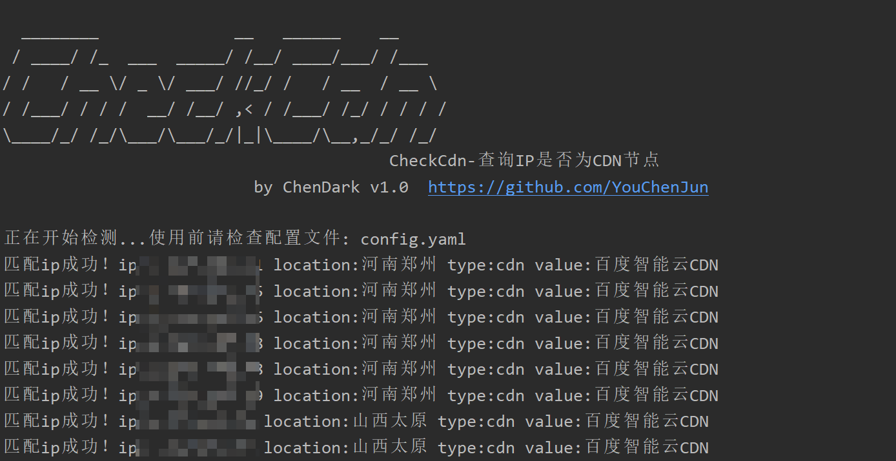
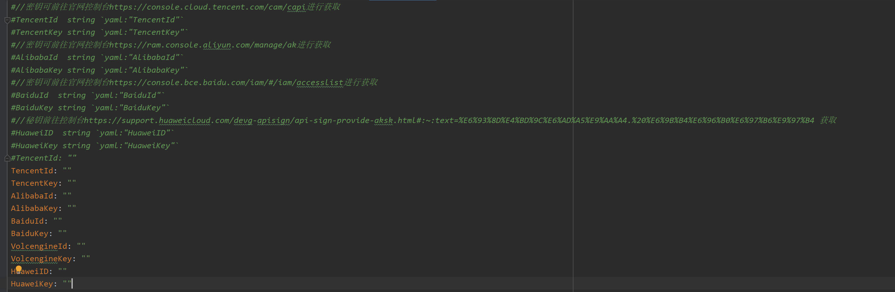
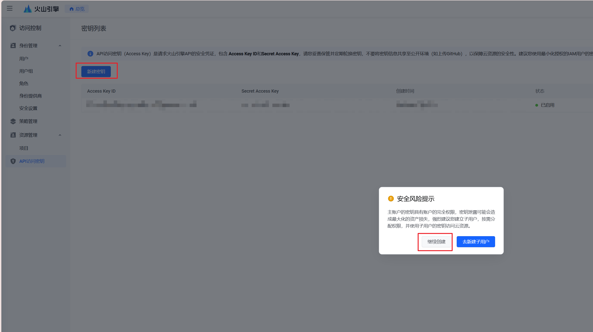
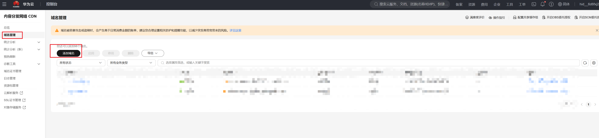
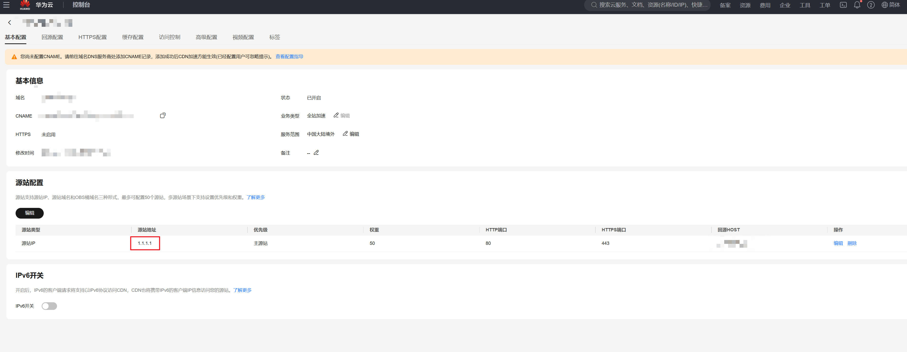

# 一、工具概述

​	在日常的渗透测试中，往往从IP、C段入手可以发现到很多不一样的资产信息。快速筛选出真实IP并且整理为C段扫描是其中的一个攻击方式，在面对大量IP资产的时候取出CDN节点、负载均衡节点尤为重要。

>​	本工具实现原理就是调用各大云厂商的对应CDN API，查询IP是否为该厂商的CDN节点，最后由ipdb和收集到的IP c段做数据兜底。现已支持的云厂商有
>
>- [火山云](https://www.volcengine.com/docs/6454/71436)
>- [腾讯云](https://cloud.tencent.com/document/api/228/37868)
>- [阿里云](https://api.aliyun.com/document/Cdn/2018-05-10/DescribeIpInfo)
>- [百度云](https://cloud.baidu.com/doc/CDN/s/8jwvyeunq)
>- [华为云](https://support.huaweicloud.com/api-cdn/ShowIpInfo.html)
>
>详细的说明见本文的`四、实现原理`

# 二、工具使用

​	首次运行程序后会在该目录下创建`config.yaml`配置文件，请查看本文档的**四、实现原理**进行配置

```
  -config string
        配置文件夹路径 (default "config.yaml")
  -delayed float
        查询延迟时间,默认0s
  -input string
        需要检测的ip文件列表
  -output string
        不是CDN节点的ip文本列表 (default "nocdn.txt")
```

​	程序运行后会自动进行调取api检测，非CDN的ip结果内容默认在`nocdn.txt`中



​	由于部分厂商的接口短时间内频繁调取会出现拦截，请根据自己的实际情况配置`-delayed`参数

# 三、秘钥配置



​	这里的秘钥指的是云厂商的AK、SK，请根据不同厂商按照链接开启并且获取。**AK、SK获取后请保存，高权限的AKSK可以调取云平台的相关服务、请求。**

​	下面操作部分云厂商需要开启CDN服务，其中涉及到开通需要充值一定数额才可使用。根据此教程合理配置，重置的金额可在开通后退费，并且后续不会产生CDN的费用。**，对于配置CDN其他的功能出现的扣费问题，本人和此教程不承担任何责任。**

​	下列操作在创建秘钥的时候会提示是否创建子账号，建议使用不创建子账号，使用主账号的秘钥。若云账号上有大量的服务器、资源等，建议创建一个新的个人账号完成下面操作。

## 腾讯云

[密钥管理 - 常用工具 - 人脸核身 - 控制台 (tencent.com)](https://console.cloud.tencent.com/cam/capi)

​	获取AK、SK后无需开通CDN的服务即可调用相关API

## 火山云

[访问控制-火山引擎 (volcengine.com)](https://console.volcengine.com/iam/keymanage/)



​	[内容分发网络 (volcengine.com)](https://console.volcengine.com/cdn/homepage)

​	开通CDN服务，需要给账户内充值100元，在开通服务后可以退还

## 阿里云

[RAM 访问控制 (aliyun.com)](https://ram.console.aliyun.com/profile/access-keys)

​	获取AK、SK即可，无需开通CDN服务

## 百度云

[百度智能云-管理中心 (baidu.com)](https://console.bce.baidu.com/iam/#/iam/accesslist)

​	获取AK、SK即可，无需开通CDN服务

## 华为云

[获取AK/SK_API签名指南_华为云 (huaweicloud.com)](https://support.huaweicloud.com/devg-apisign/api-sign-provide-aksk.html)

​	华为云需要账户内充值1k后开启CDN服务，并且配置一个加速域名。在开启后可退费1k

[CDN - 控制台 (huaweicloud.com)](https://console.huaweicloud.com/cdn/?region=cn-north-4&locale=zh-cn#/cdn/overview)	

​	需要准备一个自己的域名



​	注意配置源站地址



​	此处是因为华为云的产品特性，只有开启了加速域名才可以使用API查询出数据。

# 四、实现原理

​	本工具实现原理就是调用各大云厂商的对应CDN API，查询IP是否为该厂商的CDN节点，最后由ipdb和收集到的IP c段做数据兜底。现已支持的云厂商有

- [火山云](https://www.volcengine.com/docs/6454/71436)
- [腾讯云](https://cloud.tencent.com/document/api/228/37868)
- [阿里云](https://api.aliyun.com/document/Cdn/2018-05-10/DescribeIpInfo)
- [百度云](https://cloud.baidu.com/doc/CDN/s/8jwvyeunq)
- [华为云](https://support.huaweicloud.com/api-cdn/ShowIpInfo.html)

​	如果各位师傅发现其他云厂商有类似的API接口，欢迎提交issue和pr。

​	**部分云厂商调取API需要开启CDN的服务，有的需要账户内需要余额方可开启！本人测试上述云尝试可以充值开启服务后提现**

​	开启CDN服务单纯使用本工具是不需要任何资费，对于配置CDN其他的功能出现的扣费问题，本人和此教程不承担任何责任。

​	最后的数据兜底来源于[ipipfree.ipdb](https://www.ipip.net/)和收集的部分C段，如果师傅们有最新的数据文件可以提交issue和pr。

# 五、TODO

- 输出json格式
- 优化并行逻辑
- httpx等工具适配

# 六、免责说明

1. 如果您下载、安装、使用、修改本工具及相关代码，即表明您信任本工具
2. 在使用本工具时造成对您自己或他人任何形式的损失和伤害，我们不承担任何责任
3. 如您在使用本工具的过程中存在任何非法行为，您需自行承担相应后果，我们将不承担任何法律及连带责任
4. 请您务必审慎阅读、充分理解各条款内容，特别是免除或者限制责任的条款，并选择接受或不接受
5. 除非您已阅读并接受本协议所有条款，否则您无权下载、安装或使用本工具
6. 您的下载、安装、使用等行为即视为您已阅读并同意上述协议的约束


# Star History


